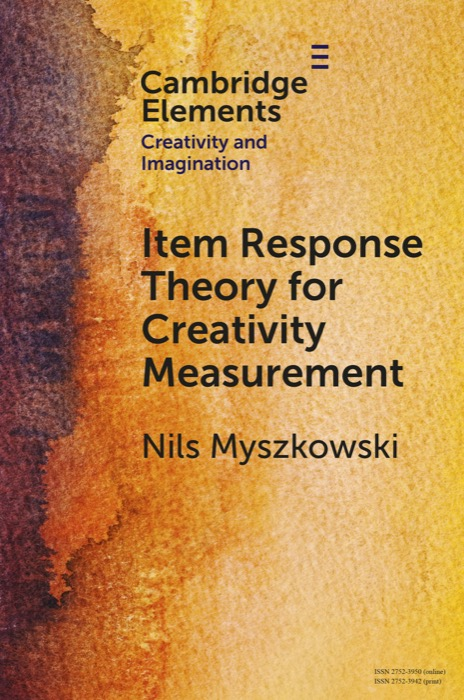

Published by Cambridge University Press in the <em>Cambridge Elements in Creativity and Imagination</em> series, this book presents a concise overview of item response theory for researchers interested in how creativity and related psychological attributes can be measured more rigorously.

This book reflects one strand of my work as a psychometrician: the effort to make measurement models both conceptually clear and practically useful.

The book discusses classical test theory and its limits, core ideas in item response theory, practical model-building strategy, and examples drawn from creativity research, including fluency scores, judgment data, and other measurement situations where standard scoring practices can be improved.

It is written for researchers, students, and quantitatively oriented practitioners who want a compact but serious introduction to modern test theory, especially in contexts where psychometric decisions directly affect how scores are interpreted.

<a class="btn-links mr2 ba dib" href="https://www.cambridge.org/us/universitypress/subjects/psychology/psychology-general-interest/item-response-theory-creativity-measurement?format=PB" target="_blank" rel="noopener"><i class="fas fa-link fa-lg fa-fw mr2"></i>Cambridge page</a>

